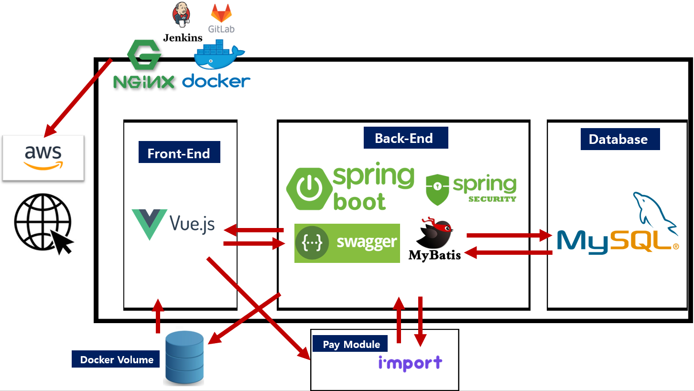
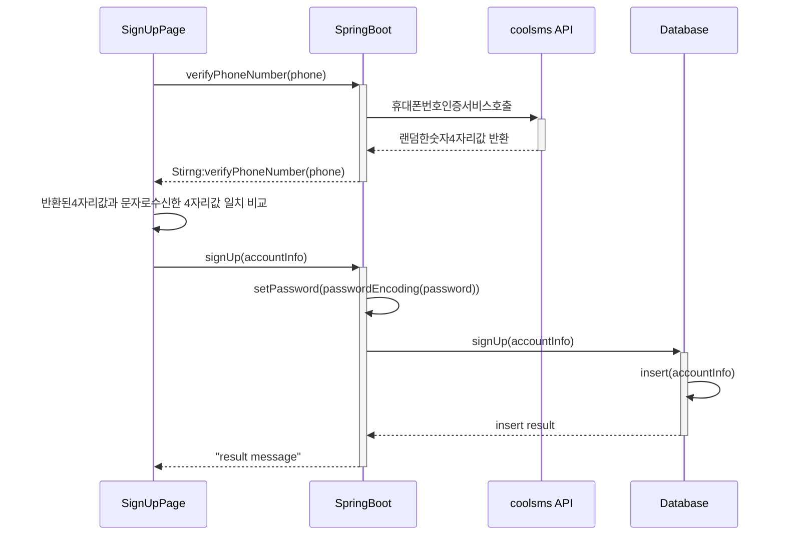
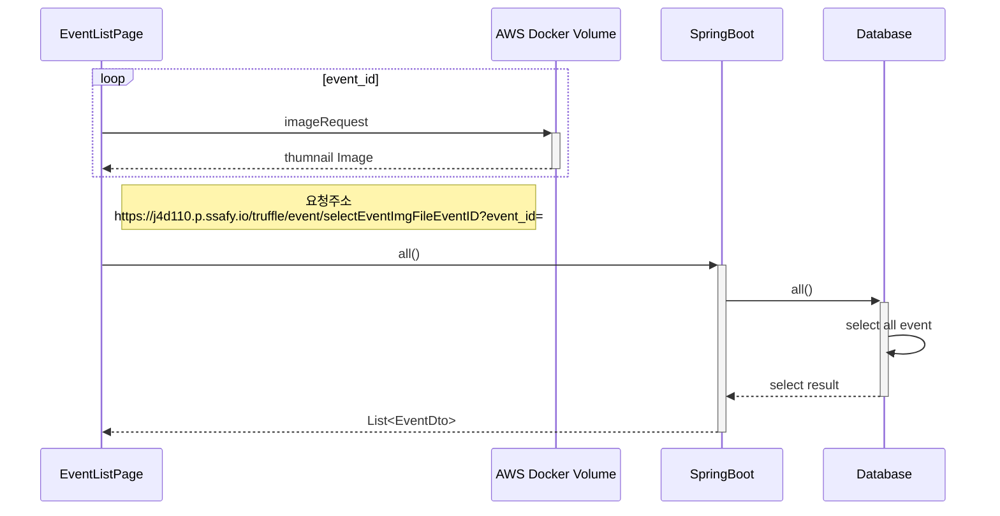
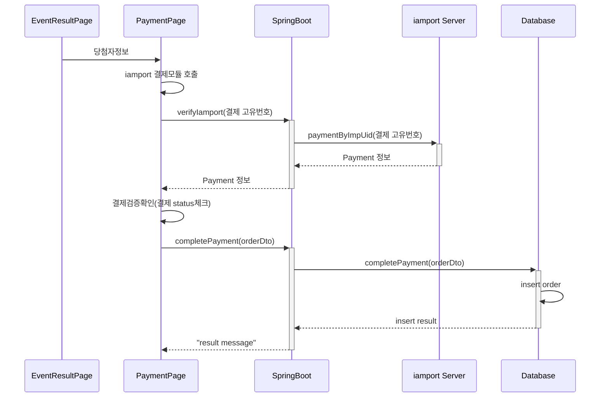
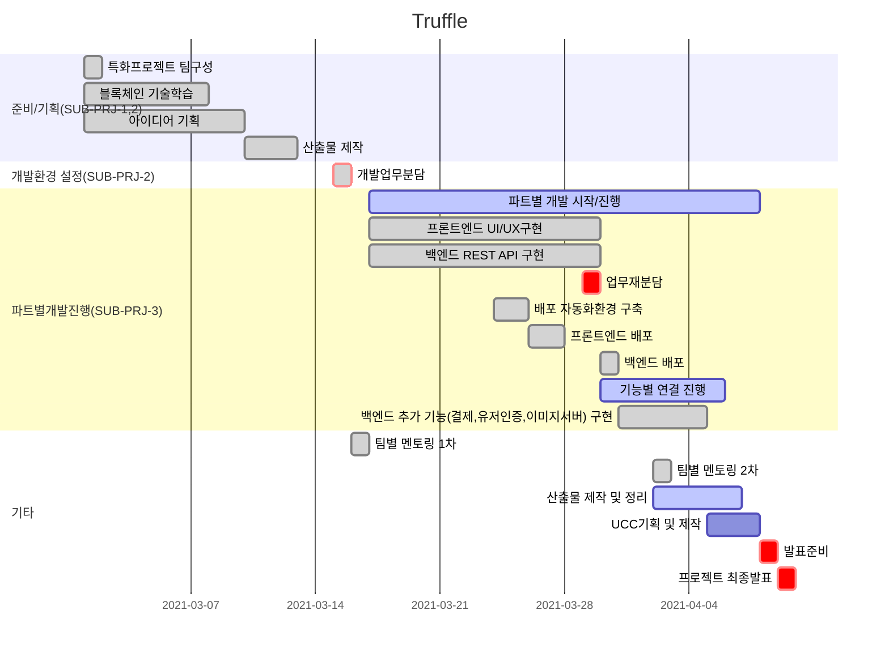

### 

---

> Truth + Raffle 의 합성어로 한정판에 대한 구매권 응모(래플) 중개서비스


----

개발환경 실행

​	백엔드 (SpringBoot)
```
STS
 File - Import Projects from File System or Archieve
 Import source : /s04p23d110/backend
Run: 프로젝트 우폴더 클릭후 Run As - SpringBootApp
실행백엔드서버: http://localhost:8000
API문서 주소(Swagger): http://localhost:8000/truffle/swagger-ui.html
```


​	프론트엔드(vue-js)
```
npm install
npm run serve
실행 프론트엔드: http://localhost:8080/
```


배포환경 

​	AWS웹서비스 주소 : http://j4d110.p.ssafy.io/

​	젠킨스 자동배포 주소 : http://j4d110.p.ssafy.io:9090/

​    Swagger-ui 주소 : https://j4d110.p.ssafy.io/truffle/swagger-ui.html

---


### 기술스택



---

### 업무분담

1. 기획

   기획서 및 기획안 PPT : 이혜지

   산출물작성

   ​	ERD: 윤예준

   ​	와이어프레임 : 이원회

   ​	기능정의서(JIRA이슈) : 윤예준

   ​	시퀀스다이어그램 : 윤예준

   UCC기획 및 편집 : 이원회, 이혜지


2. 개발

   테크리더 : 윤예준

   ​	Git관리 : master,develop에 대한 관리 

   개발자

   ​	프론트엔드(Vue.js) : 이원회, 이혜지

   ​	DataBase설계 (MySQL) : 윤예준

   ​	백엔드(SpringBoot): 윤예준

   ​	배포환경구축 및 자동화(AWS, Docker, Jenkins) : 윤예준

   

2. QA

   기획 산출물을 기반으로 테스트 케이스를 작성 및 수행 : 이원회

   ​	수행결과 버그 발생시 JIRA에 BUG아이템으로 생성 및 관리

   JIRA관리 : 윤예준

   ​	이슈,스프린트생성

   산출물 : 이원회, 이혜지

   ​	테스트 케이스 및 수행 결과

   샘플데이터 작성: 이혜지

   sonarQube 관리 : 윤예준

   ​	발생한 이슈에 대한 대응(코드 수정 및 알림)


---

### ERD 다이어그램


---


### 주요 Sequence Diagram

#### 회원가입
전화번호 인증 API를 호출후 회원가입 절차 진행, 비밀번호는 SpringSecurity로 암호화하여 DB에 저장



#### 이벤트 전체조회



#### 당첨자 구매진행




------


### 개발일정



