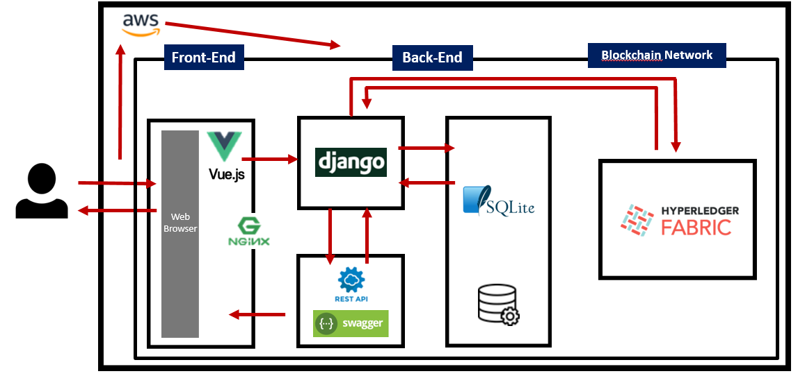

### 

---

> Truth + Raffle 의 합성어로 한정판에 대한 블록체인 정품 보증 및 구매권 응모(래플) 중개서비스

### 기술스택

---

### 업무분담

#### 기획 및 설계

- 기획서 : 이혜지, 윤예준
- ERD : 이창근
- 시퀀스다이어그램 : 이은지
- 기능정의서(JIRA이슈생성) : 윤예준
- 화면정의서 및 와이어프레임 : 이원회, 윤예준
- 1차 발표 PPT : 이혜지
- 멘토링 발표 PPT : 이혜지

#### 구현

- 백엔드(django) : 이은지 / 이창근
  - 회원가입,로그인등 REST API 구축
  - 데이터베이스 구축(SQLite)
- 블록체인 네트워크 구성(Truffle / 하이퍼레저 패브릭) : 이창근 / 이은지
- 프론트엔드(Vue.js) : 이혜지 / 윤예준, 이원회
- 배포(AWS, 젠킨스, Docker) : 윤예준, 이혜지
  - 배포환경에서의 프론트,백엔드,블록체인(Geth) 구축
- 지라 관리(마스터) : 윤예준
  - 스프린트 관리, 이슈생성및 관리
- 깃랩관리(깃마스터) : 윤예준
  - 머지 관리
- 최종발표기획, 작성 : 이원회, 이혜지
  - PPT, UCC

---

### 주요 Sequence Diagram

#### 각 한정판 제품에 대한 검색기능 & 검색 결과 페이지

#### 판매자 한정판 제품 등록 기능

#### 결제서비스 기능

------

### 개발일정

