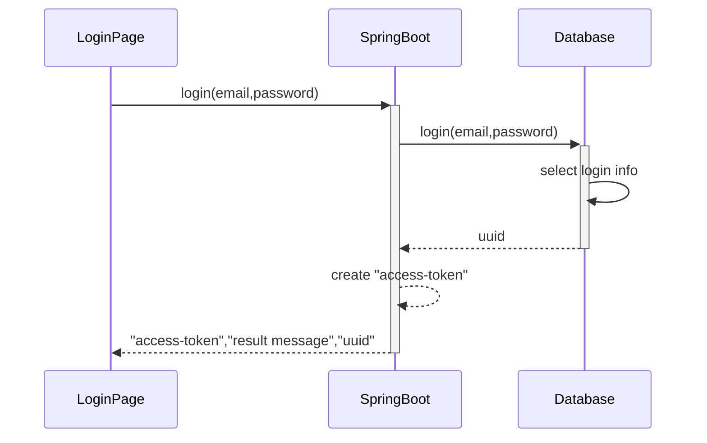
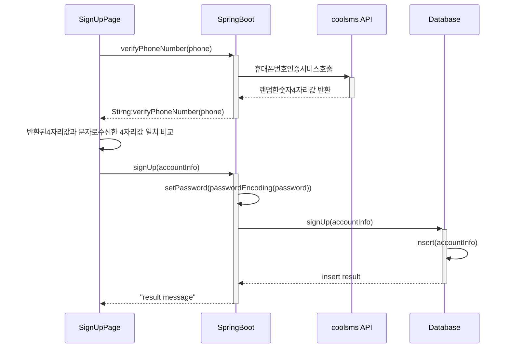
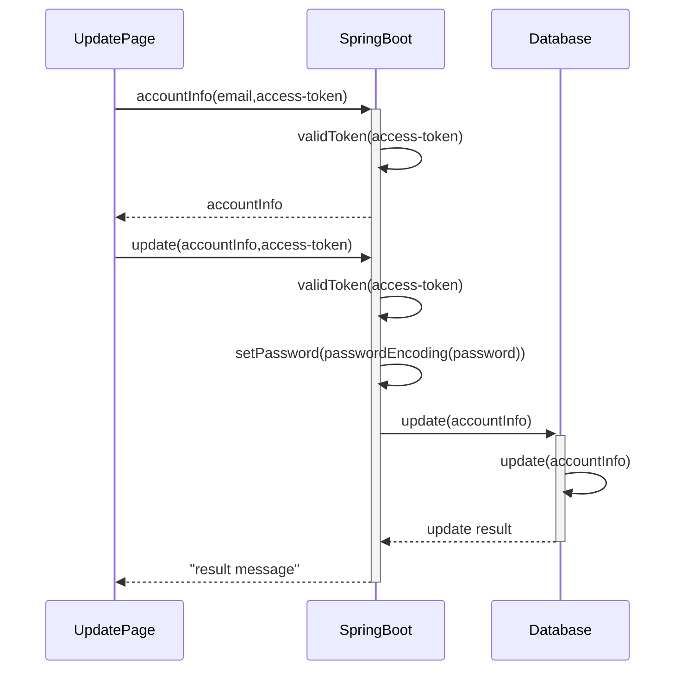
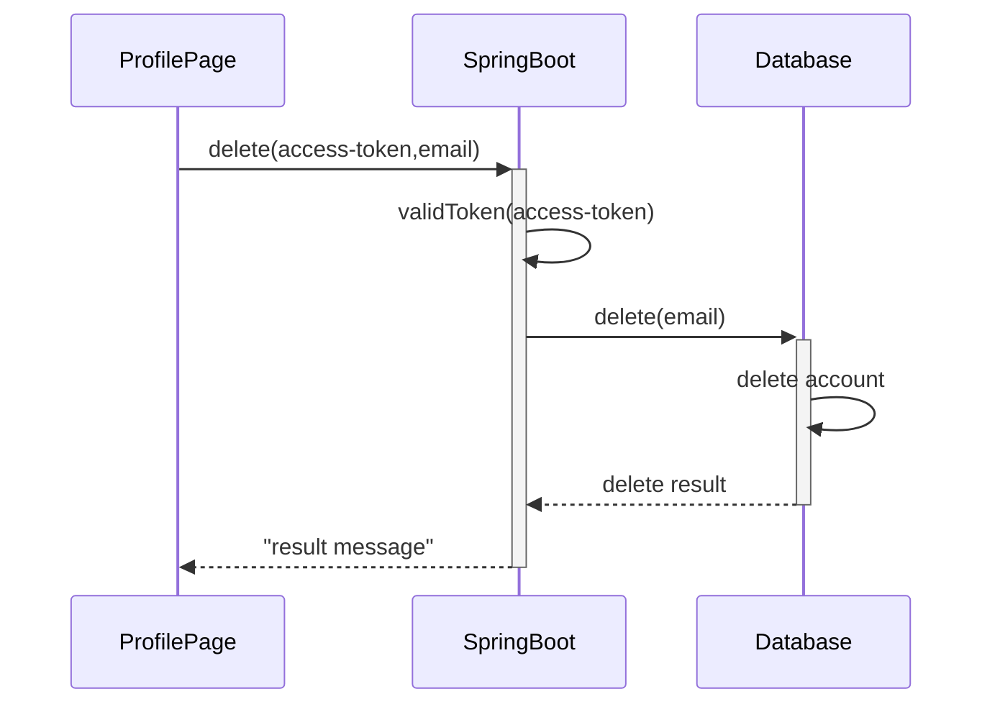
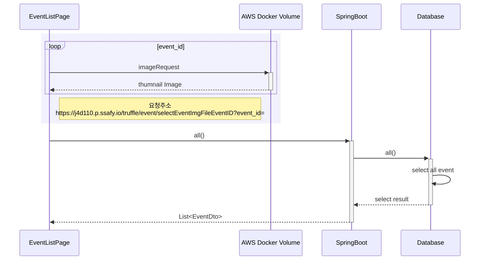
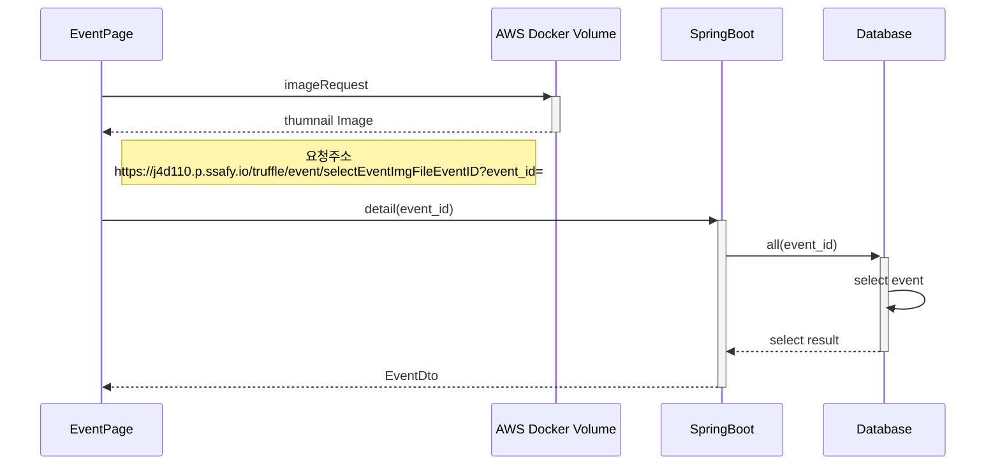
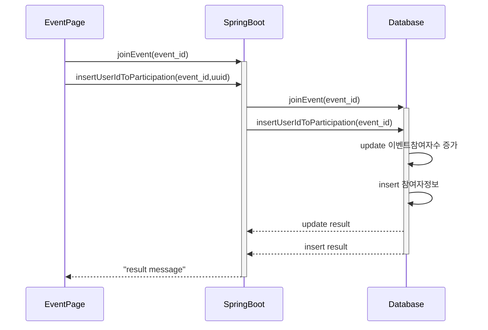
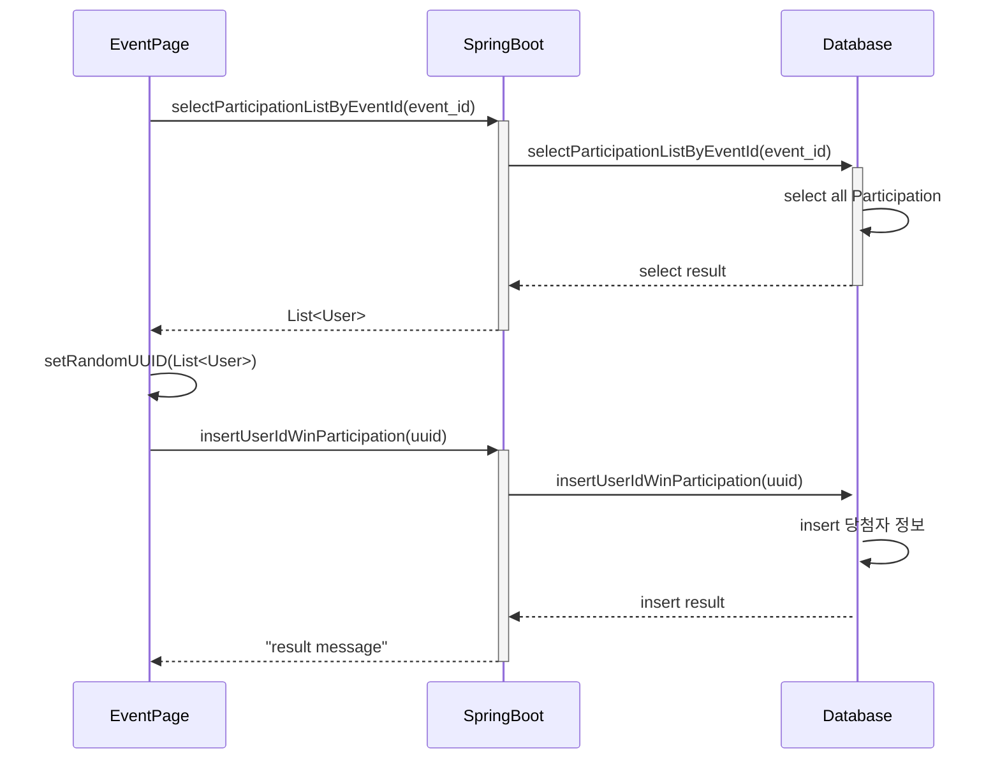
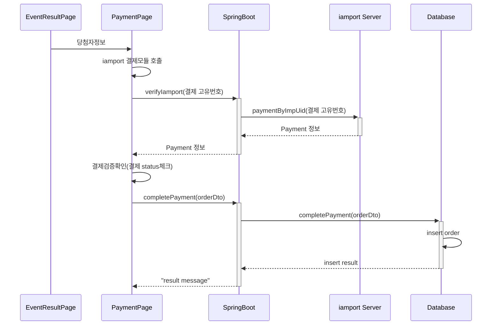
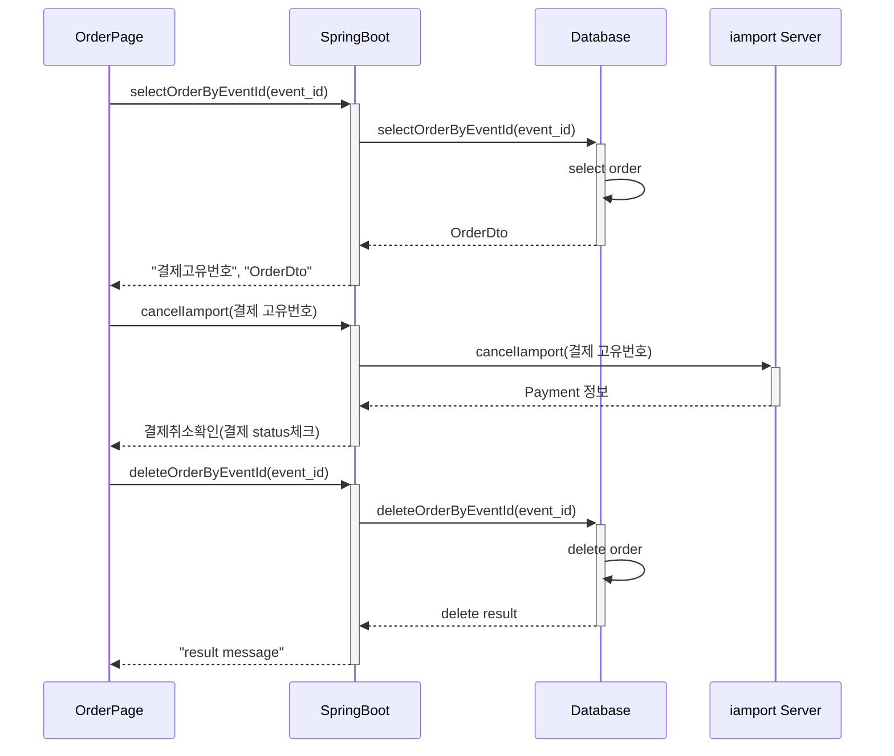

# 회원관리
## 1. 로그인

사용자가 email  password를 입력하면, 해당 정보를 DB에서 확인 후 결과에따라 access-token생성, 그후 결과메시지와 uuid 값을 전송

## 2. 회원 가입

전화번호 인증 API를 호출후 회원가입 절차 진행, 비밀번호는 SpringSecurity로 암호화하여 DB에 저장

accountInfo: email, password, phone, address, address_detail, business_number,nickname, type(유저구분), 						gender, age

## 3. 회원정보 수정
회원정보를 가져오는 accountInfo를 호출하여 받아온후 update를 호출하여 회원정보 수정 요청
access-token 검증이 필요함

## 4. 회원탈퇴

---

# 이벤트 관리

## 1. 이벤트 전체조회

## 2. 이벤트 상세조회

## 3. 이벤트 참여

## 4. 이벤트 당첨자 추첨

---

# 주문 관리

## 1. 당첨자 구매 진행

## 2. 당첨자 구매취소 진행

