# Truffle = Trust+Raffle 

## 1. 로그인

사용자가 ID(email)와 PW를 입력하면, 해당 정보를 DB에서 확인한다.

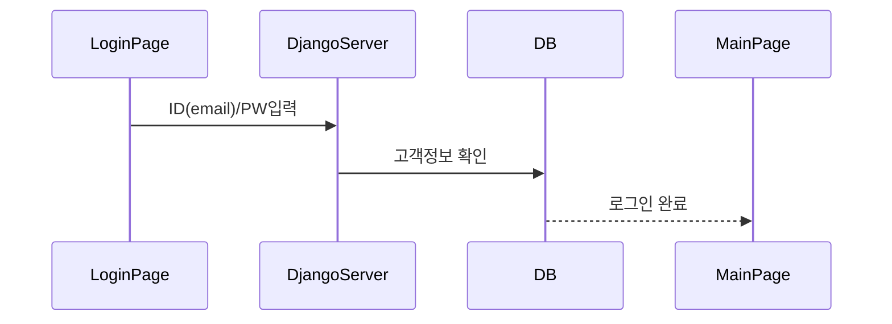

## 2. 회원 가입

전화번호 인증 API를 거쳐 본인인증(실명인증)이 완료되면 회원가입을 진행한다. 

#### 본인인증 성공할 경우

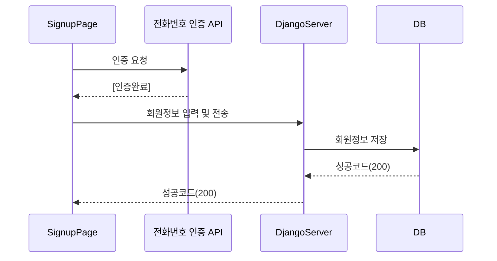

#### 본인인증 실패할 경우

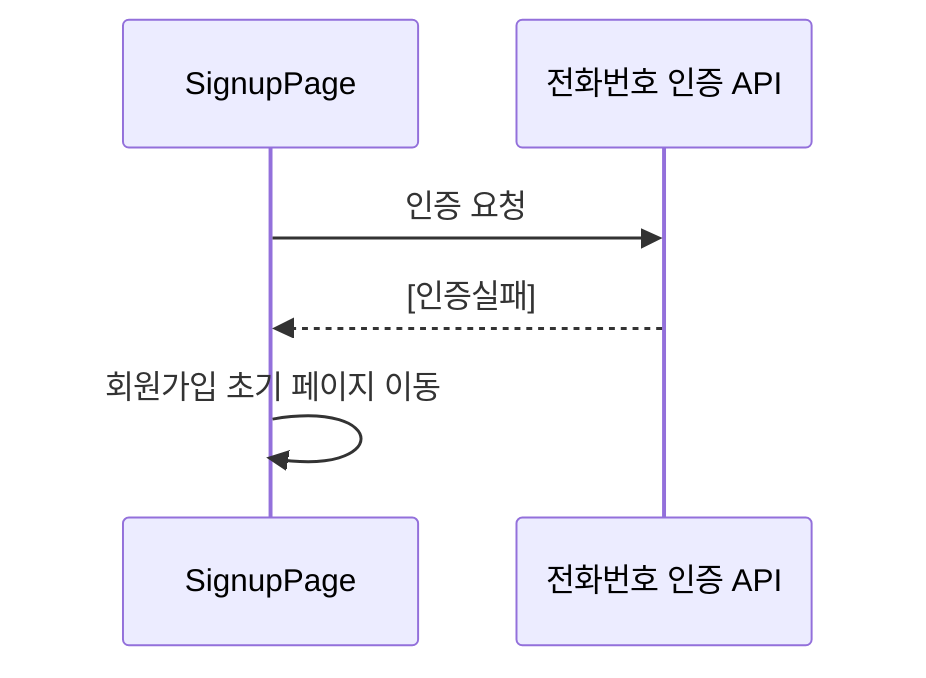

## 3. 로그아웃

로그아웃 버튼을 클릭하면 해당 정보가 서버로 전송되며, 유저와의 연결이 해제된다.

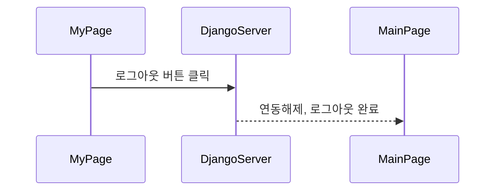

## 4. 회원정보 수정

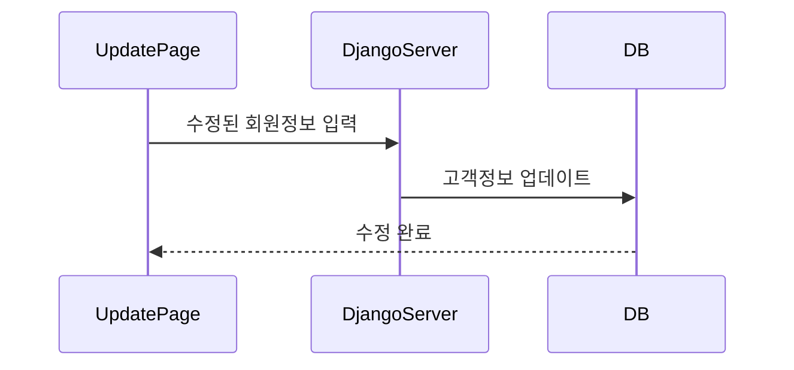

## 5. 회원탈퇴

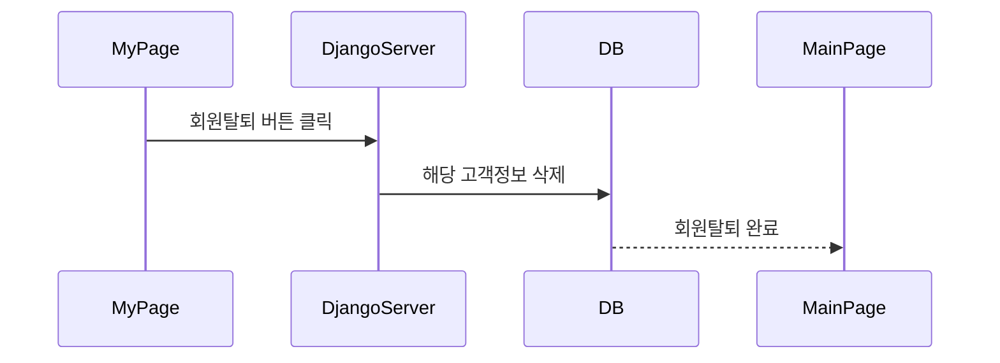

## 6. 회원정보 확인

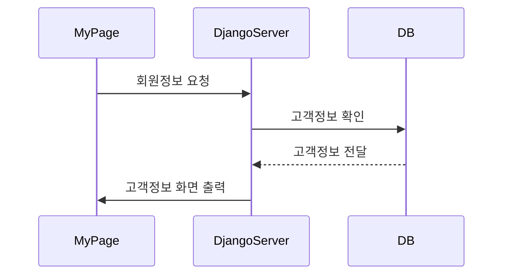

## 7. 성별, 나이, 구매이력 등으로 우선추천기능

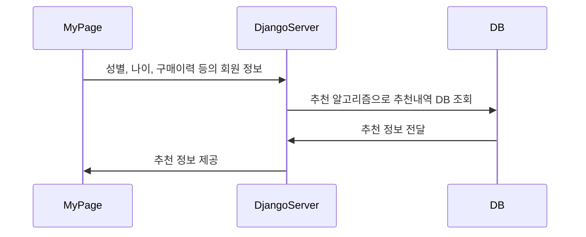

## 8. 카카오톡 채팅봇 연동

채팅 서버는 별도의  카카오톡 채팅 서버를 거쳐 서비스 된다.

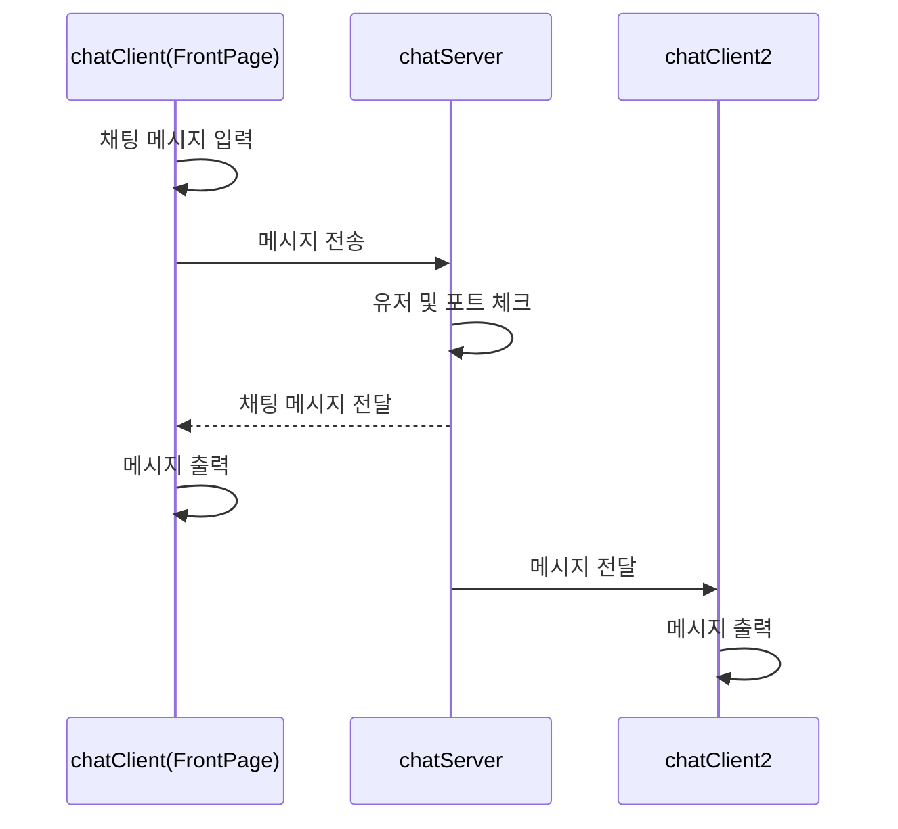

## 9. 광고

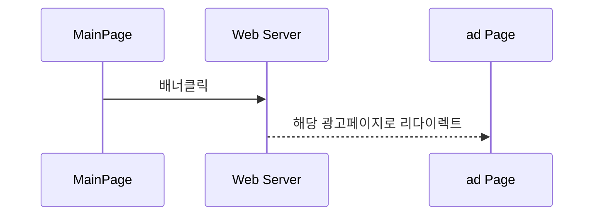

## 10. 판매자 한정판 제품 등록 기능

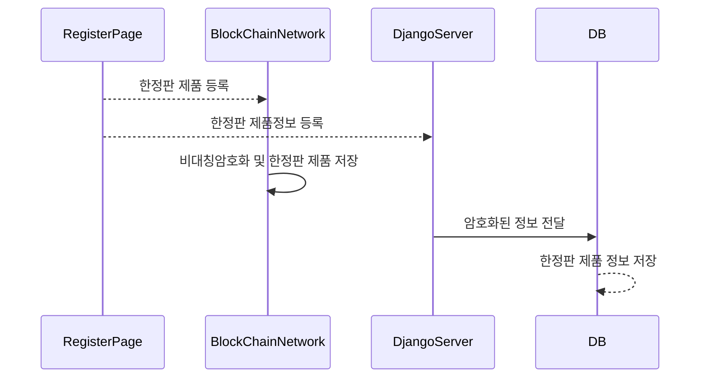

## 11. 각 한정판 제품에 대한 검색기능 & 검색 결과 페이지

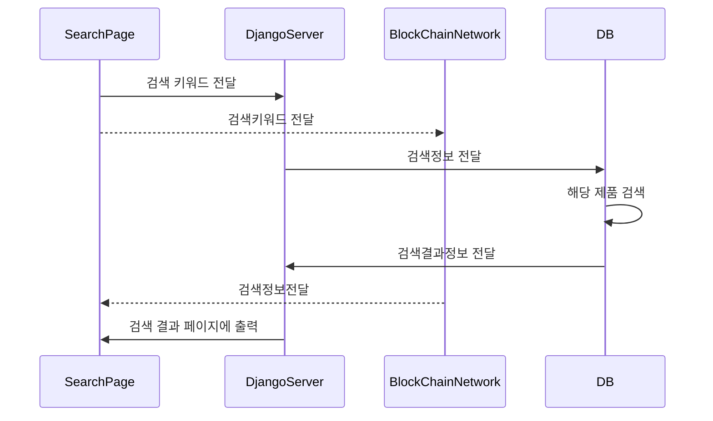

## 12. 결제서비스 기능

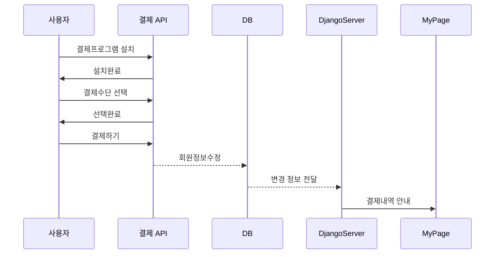

